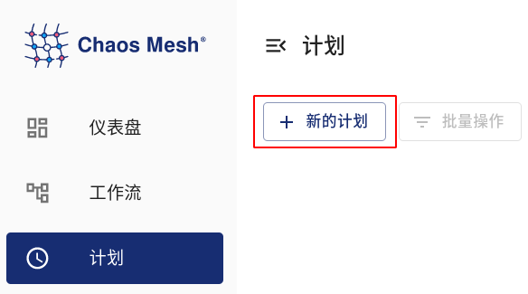
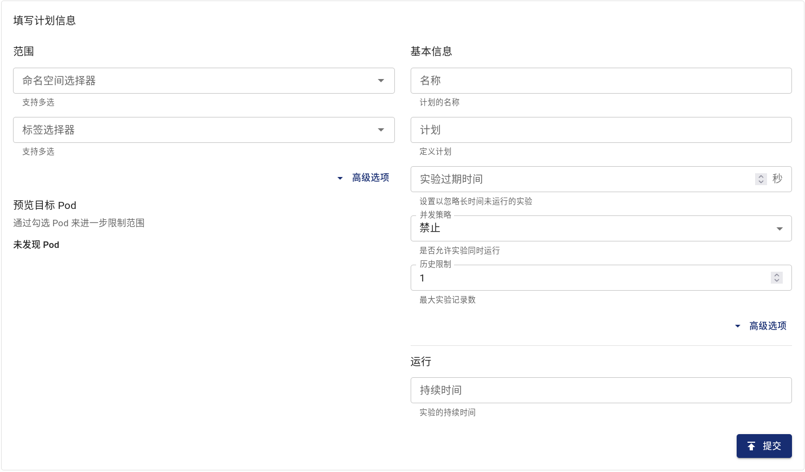

## Schedule 简介

本文档主要介绍如何在 Chaos Mesh 中创建定时任务，从而在固定的时间（或根据固定的时间间隔）自动新建混沌实验。

在 Kubernetes 中，Chaos Mesh 使用 `Schedule` 对象来描述定时任务。

:::note 注意

一个 `Schedule` 对象名不应超过 57 字符，因为它创建的混沌实验将在名字后额外添加 6 位随机字符。一个包含有 `Workflow` 的 `Schedule` 对象名不应超过 51 字符，因为 Workflow 也将在创建的名字后额外添加 6 位随机字符。

:::

## 使用 YAML 文件与 `kubectl` 创建 Schedule 调度规则

以在每个小时的第 5 分钟持续 12 秒施加 100 毫秒延迟为例：

```yaml
apiVersion: chaos-mesh.org/v1alpha1
kind: Schedule
metadata:
  name: schedule-delay-example
spec:
  schedule: '5 * * * *'
  historyLimit: 2
  concurrencyPolicy: 'Allow'
  type: 'NetworkChaos'
  networkChaos:
    action: delay
    mode: one
    selector:
      namespaces:
        - default
      labelSelectors:
        'app': 'web-show'
    delay:
      latency: '10ms'
      correlation: '100'
      jitter: '0ms'
    duration: '12s'
```

将此 YAML 文件保存至 `schedule-networkchaos.yaml`，运行 `kubectl apply -f ./schedule-networkchaos.yaml` 即可。

依据此配置，Chaos Mesh 将会在每个小时的第五分钟（比如 0:05, 1:05...）创建以下 `NetworkChaos` 对象：

```yaml
apiVersion: chaos-mesh.org/v1alpha1
kind: NetworkChaos
metadata:
  name: schedule-delay-example-xxxxx
spec:
  action: delay
  mode: one
  selector:
    namespaces:
      - default
    labelSelectors:
      'app': 'web-show'
  delay:
    latency: '10ms'
    correlation: '100'
    jitter: '0ms'
  duration: '12s'
```

在后文中会对 `Schedule` 中的字段进行描述，大多与 Kubernetes `CronJob` 的字段等价。可以参考 Kubernetes CronJob 的[文档](https://kubernetes.io/zh/docs/concepts/workloads/controllers/cron-jobs/)。

:::note 注意

`Schedule` 中 `schedule` 字段对应的时区以 `chaos-controller-manager` 的时区为准。

:::

### `schedule` 字段

`schedule` 字段用于指定实验发生的时间。

```
# ┌───────────── 分钟 (0 - 59)
# │ ┌───────────── 小时 (0 - 23)
# │ │ ┌───────────── 月的某天 (1 - 31)
# │ │ │ ┌───────────── 月份 (1 - 12)
# │ │ │ │ ┌───────────── 周的某天 (0 - 6) （周日到周一；在某些系统上，7 也是星期日）
# │ │ │ │ │
# │ │ │ │ │
# │ │ │ │ │
# * * * * *
```

| 输入                   | 描述                         | 等效替代      |
| ---------------------- | ---------------------------- | ------------- |
| @yearly (or @annually) | 每年 1 月 1 日的午夜运行一次 | 0 0 1 1 \*    |
| @monthly               | 每月第一天的午夜运行一次     | 0 0 1 \* \*   |
| @weekly                | 每周的周日午夜运行一次       | 0 0 \* \* 0   |
| @daily (or @midnight)  | 每天午夜运行一次             | 0 0 \* \* \*  |
| @hourly                | 每小时的开始一次             | 0 \* \* \* \* |

如果想要生成时间表达式，你还可以使用 [crontab.guru](https://crontab.guru) 等 Web 工具。

### `historyLimit` 字段

一项实验在结束之后并不会被删除，这是为了方便用户检索和观察实验结果，在出错时能够排查。在 `historyLimit` 中设定的数值为保留的任务数，这一数量包括了正在运行中的任务。当然，Chaos Mesh 并不会删除正在运行中的任务。

当存在超过 `historyLimit` 数量的任务时，Chaos Mesh 将会按照顺序依次删除最早创建的任务。如果那些任务还在继续，则会跳过。

### `concurrencyPolicy` 字段

该字段所有可用的值为 `"Forbid"`、`"Allow"`、`""`。

该字段用于指定是否允许该 `Schedule` 对象创建多个同时运行的实验。比如 `schedule: * * * * *` 配置下，每分钟创建一个实验对象，而如果实验对象的 `duration` 配置为 70 秒，则会出现多个实验同时发生的情况。

`concurrencyPolicy` 字段默认为 `Forbid`，即不允许多个实验同时发生。当 `concurrencyPolicy` 字段为 `Allow` 时，将允许多个实验同时发生。

在以下配置的基础上，仍以延迟为例：

```yaml
spec:
  schedule: '* * * * *'
  type: 'NetworkChaos'
  networkChaos:
    action: delay
    mode: one
    selector:
      namespaces:
        - default
      labelSelectors:
        'app': 'web-show'
    delay:
      latency: '10ms'
    duration: '70s'
```

如果设置 `concurrencyPolicy: "Allow"`，则表现为在每分钟中存在 10 秒有 20 毫秒的延迟，而其他 50 秒将存在 10 毫秒的延迟；如果设置 `concurrencyPolicy: "Forbid"`，则表现为一直有 10 毫秒的延迟。

:::note 注意

并非所有实验类型均支持多个实验对同一 Pod 生效。详见各实验类型的文档。

:::

### `startingDeadlineSeconds` 字段

`startingDeadlineSeconds` 默认值为 0。

在 `startingDeadlineSeconds` 为 0 时，Chaos Mesh 将检查从上一次调度发生到当前时间为止，期间是否有错过的实验（这种情况在用户关闭 Chaos Mesh、长期暂停 Schedule、设置 `concurrencyPolicy` 为 `Forbid` 时可能发生）。

在 `startingDeadlineSeconds` 的值大于 0 时，Chaos Mesh 将检查从当前时间开始，过去的 `startingDeadlineSeconds` 秒内是否有错过的实验。如果 `startingDeadlineSeconds` 的值过小可能会错过一些实验，以下给出一个例子：

```yaml
spec:
  schedule: '* * * * *'
  type: 'NetworkChaos'
  networkChaos:
    action: delay
    mode: one
    selector:
      namespaces:
        - default
      labelSelectors:
        'app': 'web-show'
    startingDeadlineSeconds: 5
    delay:
      latency: '10ms'
    duration: '70s'
```

由于 `concurrencyPolicy` 为 `Forbid`，在分钟的开始会因为这一限制而禁止创建新任务。而在该分钟的第十秒，上一次创建的 Chaos 运行结束，但由于 `startingDeadlineSeconds` 的限制不会检索到因 `concurrencyPolicy` 而错过的事件，所以不会创建 Chaos。在下一分钟开始时才会创建新的 Chaos。

而如果不设置 `startingDeadlineSeconds` （或设置为 0），则表现为一直有 10 毫秒的延迟。这是因为在运行着的任务结束之后，Chaos Mesh 发现一段时间前错过了一个任务（因为 `concurrencyPolicy` 的阻止），于是立即创建了新的任务。

这一字段在 Kubernetes CronJob 的[文档](https://kubernetes.io/zh/docs/concepts/workloads/controllers/cron-jobs/#cron-job-limitations)中拥有其他例子与类似解释。

### 定义实验

在 `Schedule` 中需要使用两个字段来定义实验的具体内容。`type` 字段和 `*Chaos` 字段。其中 `type` 字段用于指定实验类型，`*Chaos` 字段用于描述实验内容。通常来说，`type` 字段的内容为大驼峰，例如 `NetworkChaos`、`PodChaos`、`IOChaos`；而 `*Chaos` 的键为与之对应的小驼峰，如 `networkChaos`, `podChaos`, `ioChaos`。`*Chaos` 的键为对应实验类型的 `spec`，详见个实验类型的文档。

## 使用 Dashboard 创建 Schedule 调度规则

1. 单击计划页面中的“新的计划”按钮创建计划：

   

2. 选择并填写实验的具体内容

   

3. 填写计划周期、并发策略等信息

   

4. 提交实验

### 暂停定时任务

用户可能会希望暂停混沌实验。与 `CronJob` 不同的是，暂停一个 `Schedule` 不仅仅会阻止它创建新的实验，也会暂停已创建的实验。

暂停的方法是为该 `Schedule` 对象添加 `experiment.chaos-mesh.org/pause=true` 注解。可以使用 `kubectl` 命令行工具添加注解：

```bash
kubectl annotate -n $NAMESPACE schedule $NAME experiment.chaos-mesh.org/pause=true
```

其中 `$NAMESPACE` 为命名空间，`$NAME` 为 `Schedule` 的名字。返回成功的结果如下：

```bash
schedule/$NAME annotated
```

如果要解除暂停，可以使用如下命令去除该注解：

```bash
kubectl annotate -n $NAMESPACE schedule $NAME experiment.chaos-mesh.org/pause-
```

其中 `$NAMESPACE` 为命名空间，`$NAME` 为 `Schedule` 的名字。成功返回如下：

```bash
schedule/$NAME annotated
```
